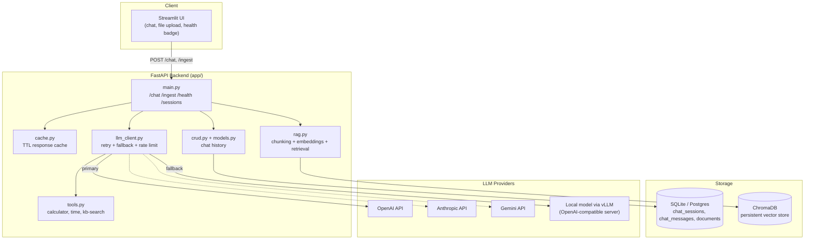

# Architecture

## System diagram

## Request flow for `/chat`

1. **Cache check** — a hash of `(message, use_rag, allow_tools)` is looked up in the in-process TTL cache; a hit short-circuits the rest of the pipeline.
2. **Retrieval** — if `use_rag=true`, the query is embedded and the top-k most similar chunks are pulled from ChromaDB and formatted into a context block.
3. **Prompt assembly** — system prompt + retrieved context + recent chat history (from SQL) + the new user message.
4. **LLM call** — `llm_client.call_llm` calls the configured primary provider with retries (exponential backoff via `tenacity`). If all retries fail, it transparently retries against `FALLBACK_LLM_PROVIDER` (e.g. a locally-hosted model via vLLM) before giving up with a `503`.
5. **Tool-calling loop** — if the model requests a tool (calculator, current time, or an explicit knowledge-base search), the backend executes it and makes one further LLM call with the tool result injected, producing the final answer.
6. **Persistence** — user and assistant messages are stored in SQL for session continuity; the response is cached for subsequent identical queries.

## Reliability mechanisms

| Concern | Mechanism | Location |
|---|---|---|
| Transient provider errors | Exponential-backoff retries | `llm_client._call_with_retry` |
| Full provider outage | Automatic fallback to secondary provider | `llm_client.call_llm` |
| Client abuse / cost control | Token-bucket rate limiter (in-process) + `slowapi` per-route limiter | `llm_client.RateLimiter`, `main.py` |
| Repeated identical queries | TTL + LRU response cache | `cache.py` |
| Unhandled errors | Global exception handler returning structured JSON | `main.py` |
| Observability | Structured JSON logs in production | `logging_config.py` |

## Scaling notes

- **Concurrency**: FastAPI + Uvicorn workers handle concurrent requests asynchronously; scale horizontally with `uvicorn --workers N` or multiple container replicas behind a load balancer.
- **Cache**: swap `TTLCache` for Redis when running multiple replicas, so cache hits are shared across instances (same `get/set/make_key` interface).
- **Database**: swap `DATABASE_URL` to Postgres for multi-instance deployments (SQLite is single-writer).
- **Vector store**: ChromaDB can run as its own server (`chromadb` Docker image) instead of the embedded persistent client for larger corpora or multi-instance access.
